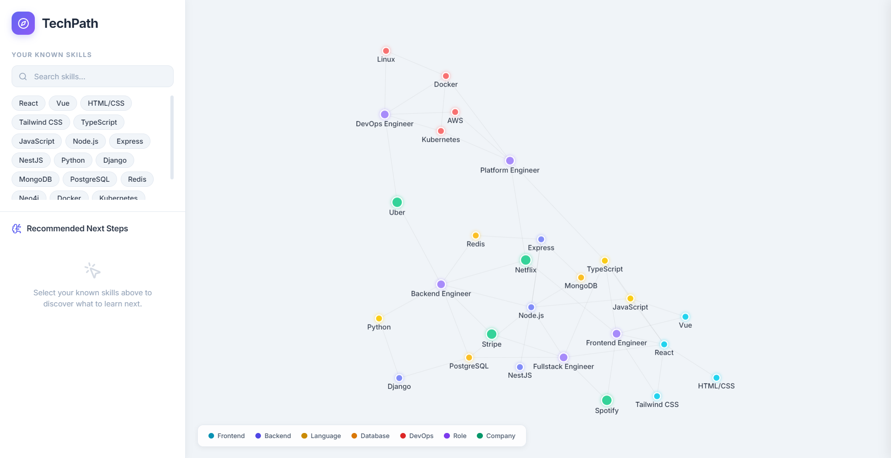
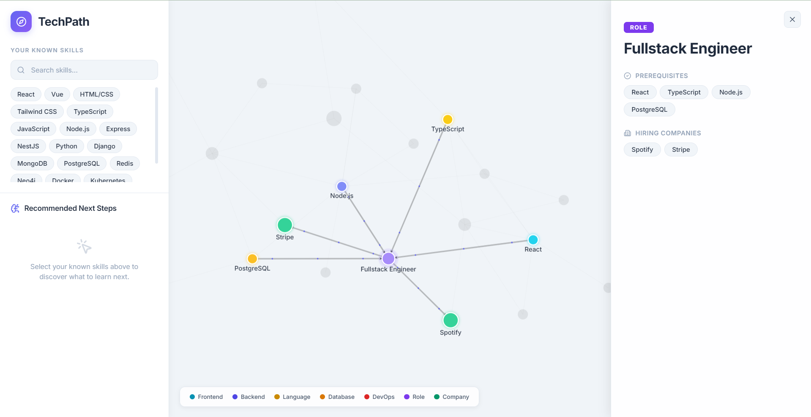
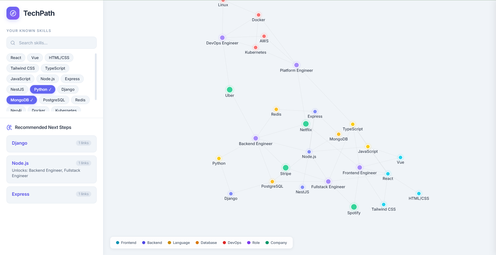

# TechPath — AI Learning & Career Graph

This is an interactive graph app I built to help developers figure out what they should learn next, what roles they can unlock, and which companies are hiring for those roles. It runs on CognoDB Cloud.

Basically, you input the skills you already know, and the app recommends what to learn next based on how everything is connected in the graph. It's kind of like a career GPS.

## Demo & Screen Recording

👉 **[Watch Screen Recording](./screenshots/Assessment_1.mp4)**

## Why a Graph Database?

Skills, roles, and companies are connected in pretty complex ways. For example, React needs JavaScript, but you also often use TypeScript with React. Both of those are required for Frontend Engineer roles, and a company like Netflix hires for that role.

If you tried to build this in Postgres or MySQL, you'd need about 5 join tables and the queries would get really messy. Especially if you wanted to ask something like "What's the shortest path from knowing Python to getting a Platform Engineer role at Netflix?" — you'd have to write a recursive CTE in SQL, which is honestly a pain.

In a graph database, this is literally just one line:
```cypher
MATCH path = shortestPath((start:Skill {id: "python"})-[*]-(end:Role {id: "platform_eng"}))
RETURN path
```

That's it. No complicated joins or recursion. The data is naturally a graph, so it makes sense to just store it like one.

## Data Model

There are 3 types of nodes and 4 types of relationships in this database:

```
  Skill ──PREREQUISITE_OF──> Skill
  Skill ──USED_WITH────────> Skill
  Skill ──USED_IN──────────> Role
  Role  ──HIRED_BY─────────> Company
```

### Nodes

| Label | Properties | Example |
|-------|-----------|---------|
| Skill | id, name, type | `{id: "react", name: "React", type: "frontend"}` |
| Role | id, title | `{id: "fe_eng", title: "Frontend Engineer"}` |
| Company | id, name | `{id: "netflix", name: "Netflix"}` |

The `type` property on Skills is just used to color the nodes in the graph visualization (frontend, backend, language, etc).

### Relationships

- `PREREQUISITE_OF` — you should learn skill A before skill B
- `USED_WITH` — these skills are commonly paired together
- `USED_IN` — you need this skill for this specific role
- `HIRED_BY` — this company is hiring for this role

The seed data I included has about 19 skills, 5 roles, 4 companies, and 42 relationships connecting everything.

## Main Cypher Queries

(Note: I used some AI to help figure out the exact Cypher syntax for these since I don't write Cypher every day, but I made sure to understand the logic behind them.)

### Skill Recommendations

This is the main query. You give it the skills you know, and it finds what to learn next and what roles that unlocks:

```cypher
MATCH (known:Skill) WHERE known.id IN $knownSkills
MATCH (known)-[:PREREQUISITE_OF|USED_WITH]-(next:Skill)
WHERE NOT next.id IN $knownSkills
OPTIONAL MATCH (next)-[:USED_IN]->(role:Role)
RETURN next, count(DISTINCT known) as connections,
       collect(DISTINCT role.title) as unlocksRoles
ORDER BY connections DESC LIMIT 5
```

This does a 2-hop traversal — jumping from known skills to new skills, then from those to roles. Doing this in SQL would require a bunch of self joins and be much harder to read.

### Shortest Path

Finding the fastest learning path from any skill to any role:

```cypher
MATCH (start:Skill {id: $skillId}), (end:Role {id: $roleId})
MATCH path = shortestPath((start)-[*]-(end))
RETURN [n IN nodes(path) | n] AS nodes, [r IN relationships(path) | type(r)] AS rels
```

The `shortestPath()` function is built straight into Cypher. In SQL, you'd need a recursive CTE which most people prefer to avoid writing.

### Node Details

When you click a node in the UI, we fetch its connections based on what type of node it is:

```cypher
-- for skills
MATCH (req:Skill)-[:PREREQUISITE_OF]->(s:Skill {id: $id}) RETURN req
MATCH (s:Skill {id: $id})-[:PREREQUISITE_OF]->(leads:Skill) RETURN leads
MATCH (s:Skill {id: $id})-[:USED_IN]->(r:Role) RETURN r

-- for roles
MATCH (s:Skill)-[:USED_IN]->(r:Role {id: $id}) RETURN s
MATCH (r:Role {id: $id})-[:HIRED_BY]->(c:Company) RETURN c
```

All these queries use parameterized inputs (`$id`, `$knownSkills`, etc.) through the neo4j-driver so there's no string concatenation.

## Screenshots





## Tech Stack

- **Backend**: Express + TypeScript + neo4j-driver
- **Frontend**: React + TypeScript + Vite
- **Graph Visualization**: react-force-graph-2d
- **Database**: CognoDB Cloud 
- **Icons**: lucide-react
- **HTTP**: axios

## Project Structure

```
├── .env.example
├── README.md
├── backend/
│   └── src/
│       ├── index.ts          # express server setup
│       ├── config/db.ts      # neo4j driver config
│       ├── routes/api.ts     # api endpoints
│       └── scripts/seed.ts   # populates the database
└── frontend/
    └── src/
        ├── main.tsx
        ├── App.tsx            # main layout with sidebar & graph
        ├── index.css          # all the styles
        └── components/
            ├── NetworkGraph.tsx  # graph component
            └── SidePanel.tsx     # slide-out details panel
```

## How to Run

### Requirements
- Node.js v18 or above 
- A CognoDB Cloud instance — head over to [console.cognodb.com](https://console.cognodb.com), create a free tier account and set up a database.

### Setup Steps

1. Clone the repo and create your `.env` file in the root:

```bash
cp .env.example .env
```

2. Add your CognoDB credentials to the `.env` file:
```
NEO4J_URI=bolt+s://db-XXXXXXXX.databases.cognodb.com
NEO4J_USER=cognodb
NEO4J_PASSWORD=your_password_here
PORT=3001
```

3. Start the Backend:
```bash
cd backend
npm install
npx tsx src/scripts/seed.ts    # seeds the graph data
npm run dev                    # starts on port 3001
```

4. Start the Frontend:
```bash
cd frontend
npm install
npm run dev                    # starts on port 5173
```

5. Open http://localhost:5173 in your browser and you're good to go.

## Environment Variables

| Variable | Description |
|----------|-----------|
| `NEO4J_URI` | Bolt URI from your dashboard |
| `NEO4J_USER` | Database username (usually `cognodb`) |
| `NEO4J_PASSWORD` | Database password |
| `PORT` | Backend port, defaults to 3001 |

These should stay out of the repo. Only `.env.example` is committed.

## Error Handling

- If the backend goes down, a red error banner shows up on the frontend.
- If you're missing credentials, the backend prints an error and exits cleanly.
- Database queries are wrapped in try/catch blocks to prevent crashes.
- There are loading spinners when data is being fetched.
- Empty states are handled gracefully when nothing is selected.